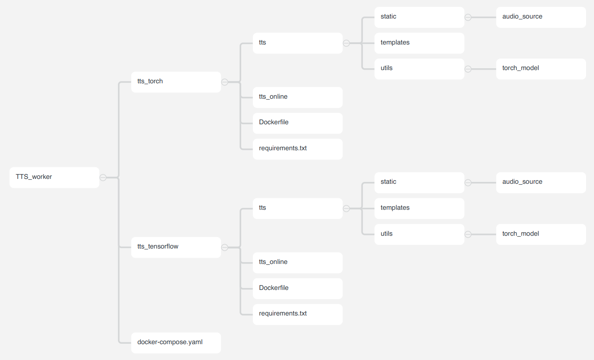

# TTS 模塊

---

## 專案架構



## 專案內容說明

- 一共兩個服務透過docker-compose管理，分別使用不同 pre-trained model（[torch](https://github.com/espnet/espnet/tree/master/egs2/TEMPLATE/tts1)  /  [tensorflow](https://github.com/TensorSpeech/TensorFlowTTS)）。

  - torch
  - tensorflow

- requirement 已經設置好

## 專案待修正BUG

- 使用 tts_tensorflow 服務若出現module not found 直接執行

  ‵```pip install git+https://github.com/repodiac/german_transliterate```

- 目前已可在本地端ON 服務，而API demo page 可以使 static中的音檔更新，但無法顯示於demo page

- tts_tensorlfow無法獨立執行，還需要跟新tts_tensorlfow中的docker file才能順利佈署

- tts_torch 可單獨運行
